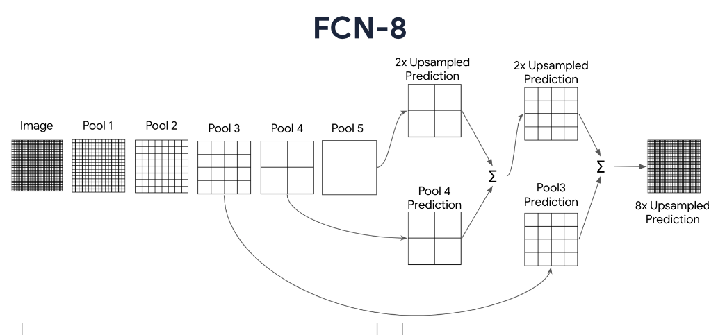
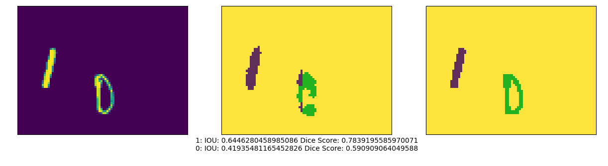
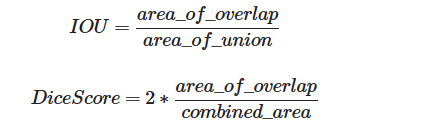

# Handwritten Digit Segmentation using Fully Convolutional Network (FCN-8)
This project focuses on the segmentation of handwritten digits using the FCN-8 architecture. Handwritten digit segmentation is a crucial step in optical character recognition (OCR) systems, where accurately isolating individual digits from a document or image is essential for subsequent recognition and analysis tasks.
# Overview
The goal of this project is to develop a deep learning model capable of accurately segmenting handwritten digits from images containing multiple digits. The model architecture used here is the FCN-8, which is well-suited for semantic segmentation tasks. The FCN-8 architecture leverages the power of fully convolutional networks to produce pixel-wise segmentation masks, enabling precise localization of digits within an image.
# FCN architacteur :

# Features
1 - Utilizes the FCN-8 architecture for semantic segmentation of handwritten digits.
2 - Preprocesses input images to prepare them for training and inference.
3 - Incorporates skip connections for improved feature propagation and finer segmentation details.
Utilizes transposed convolutions for efficient upsampling of feature maps.
4 - Applies softmax activation to generate pixel-wise probability distributions over digit classes.
Trained and evaluated on standard handwritten digit datasets
# 
# Requirements
1 - Python 3.x
2 - TensorFlow 2.x
4 -NumPy
5 - Matplotlib (for visualization)
6 - (Optional) Jupyter Notebook for interactive exploration

# Model results 

# Evaluation Metrics
## Intersection over Union (IoU)
Intersection over Union (IoU) is a common evaluation metric used in semantic segmentation tasks, including handwritten digit segmentation. It measures the overlap between the predicted segmentation mask and the ground truth mask. Higher IoU values indicate better alignment between the predicted and ground truth masks. The IoU score is calculated as the ratio of the intersection area to the union area of the predicted and ground truth masks.

## Dice Coefficient
The Dice coefficient, also known as the F1 score, is another evaluation metric commonly used in segmentation tasks. It measures the similarity between two sets, in this case, the predicted and ground truth segmentation masks. The Dice coefficient is calculated as twice the intersection of the two sets divided by the sum of their sizes. Like IoU, higher Dice coefficient values indicate better segmentation accuracy.

